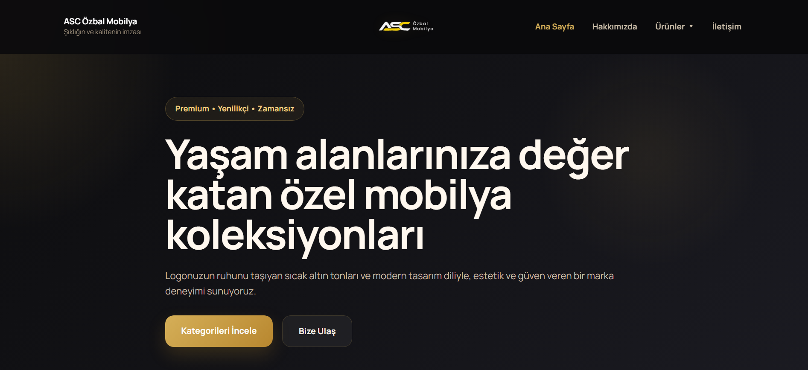
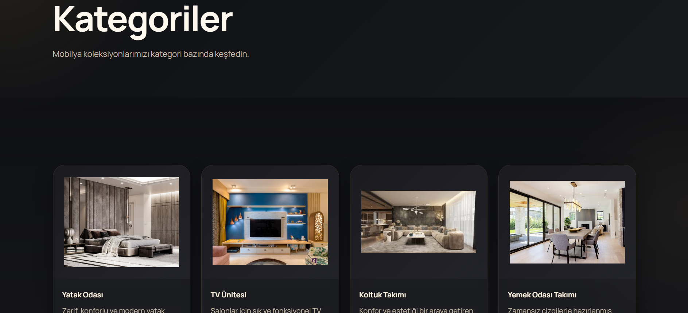
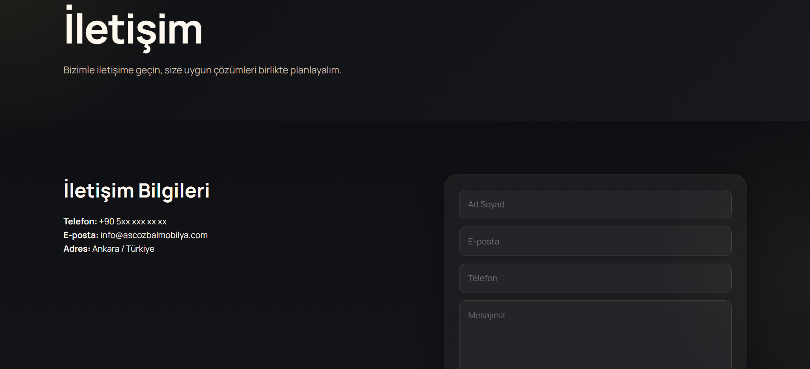

# ASC Özbal Mobilya Website

A premium furniture website project built with Node.js, Express, EJS, HTML, CSS, and JavaScript.

## Features
- Premium dark UI
- Category-based structure
- Dropdown navigation
- EJS partial layout
- Dynamic category data
- Ongoing design improvements

## Tech Stack
- Node.js
- Express.js
- EJS
- HTML
- CSS
- JavaScript

## Project Status
This project is currently in progress.

## 🚀 Preview






## Installation
```bash
npm install
npm start